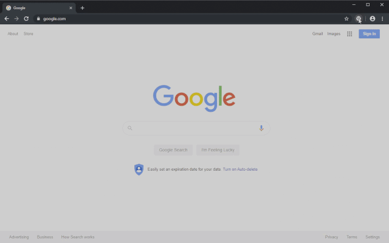

# Dark Chrome
A light-weight universal dark filter for the Google Chrome browser. Unlike other dark mode extensions, Dark Chrome doesn't invert or otherwise tamper with the colors on a website. Dark Chrome simply makes all webpages darker.

# Installation
## Google Chrome Store
Coming soon to the Google Chrome store.

## Manual installation
1. Download and unzip the latest version from the GitHub [releases page](https://github.com/pinkelement/dark-chrome/releases).
2. Go to [chrome://extensions](chrome://extensions) and enable **Developer Mode**.
3. Click **Load Unpacked** and select the unzipped folder.
4. Disable **Developer Mode**.

# License
The Dark Chrome browser extension is free for personal use. If you like the extension, please consider donating via PayPal.

<form action="https://www.paypal.com/cgi-bin/webscr" method="post" target="_top">
<input type="hidden" name="cmd" value="_s-xclick" />
<input type="hidden" name="hosted_button_id" value="582D96R5D5CBY" />
<input type="image" src="https://www.paypalobjects.com/en_US/i/btn/btn_donate_SM.gif" border="0" name="submit" title="PayPal - The safer, easier way to pay online!" alt="Donate with PayPal button" />

</form>

# Privacy Policy
The Dark Chrome browser extension does not collect any user data.

# Attributions
## Icons
     

"[Adjust](https://fontawesome.com/icons/adjust?style=solid)," "[chrome](https://fontawesome.com/icons/chrome?style=brands)," "[info-circle](https://fontawesome.com/icons/info-circle)," "[moon](https://fontawesome.com/icons/moon?style=solid)," "[power-off](https://fontawesome.com/icons/power-off?style=solid)" and "[sun](https://fontawesome.com/icons/sun?style=regular)" icons by [Font Awesome](https://fontawesome.com) are licensed under [CC BY 4.0](https://creativecommons.org/licenses/by/4.0/).

## Trademarks
Google Chrome browser and icon are trademarks of Google, Inc. The use of these trademarks do not indicate endorsement of the trademark holder by Pink Element, nor vice versa.

---
&copy; 2019 Pink Element. All rights reserved.
